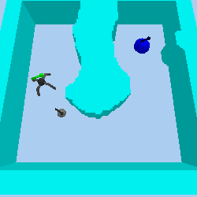
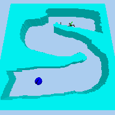
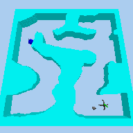
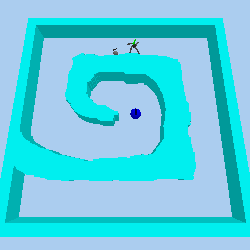
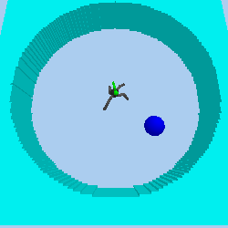
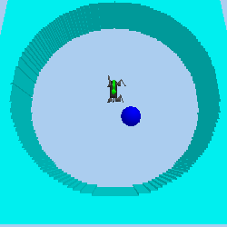
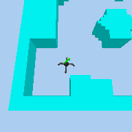
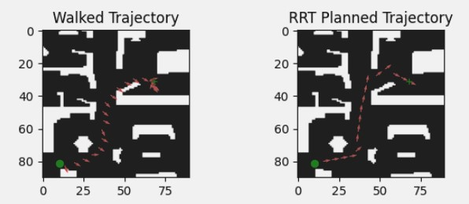

# Long Term planning with Deep Reinforcement Learning 

___

    <a href="https://github.com/dorbittonn">Dor Bitton</a> •
    <a href="https://github.com/yuvalgos">Yuval Goshen</a>
  

<!-- PROJECT LOGO -->
 

    <table>
        <tr>
            <td></td>
            <td></td>
        </tr>
        <tr>
            <td></td>
            <td></td>
        </tr>
    </table>

<!-- ABOUT THE PROJECT -->

## About The Project

The following is the graduation project of Dor Bitton & Yuval Goshen, 2 Computer engineering Bsc. students from Technion
Insitute - Haifa. 

### The Problem

The Goal of the project is to use solve problem of long term planning.
We built an environment for robots to navigate in a  goal conditioned maze from an arbitrary start point to an arbitrary
goal. The agent has to control the robot joint motors to move to the goal. This task is challenging because the robot has to plan and
navigate through the maze from motor control, that problem has long horizon for planning.

We used a Deep Reinforcement Learning algorithms to solve the problem,
but we divided the problem into 2 sub-problems that are solved independently by hierarchical agents. 

### The Stepper

    
    

- Trained in a separate environment to walk to a nearby subgoal (up to two times it's body size)
- No obstacles, just learn the task of "walking"
- Dense reward, but independent of the robot type. Reward is a function of distance from the goal plus an indicator
 that goal achieved. 
- trained with DDPG algorithm

### The Navigator

    
    

- trained to generate sub-goals for the stepper, which makes the horizon much shorter for the navigation part of the task.
- It is still different from solving a point robot maze, because the next state depends on the provided goal, and on
the stepper which is not perfect
- the robot state is not fully observable for the navigator
- We tried using one of the following algorithms:
  - TD3
  - RRT planner on the maze map where the robot is a point robot
  - RRT planner on the maze map, with extended walls to the robot size
  - TD3-MP similar to [DDPG-MP](https://arxiv.org/abs/1906.00214) with demonstrations planned by RRT.

(<a href="#top">back to top</a>)

## Tools we used for this project

* [Pytorch](https://pytorch.org/)
* [Stable-baselines3](https://stable-baselines3.readthedocs.io/en/master/)
* [Pybullet](https://pybullet.org/)
* [Tensorboard](https://www.tensorflow.org/tensorboard/get_started)
* [Weights & Biases](https://wandb.ai/)

(<a href="#top">back to top</a>)

## Contact

Dor Bitton - [Linkedin](https://www.linkedin.com/in/dor-bitton-54a1b919a/) - dorbittonn@gmail.com

Yuval Goshen - [Linkedin](https://www.linkedin.com/in/yuval-goshen-a8390b1ba/) - yuvalgos@gmail.com

(<a href="#top">back to top</a>)

## Acknowledgments

Out work is mainly based on the following papers

* [Continuous Control With Deep Reinforcement Learning](https://arxiv.org/pdf/1509.02971.pdf)
* [Playing Atari With Deep Reinforcement Learning](https://arxiv.org/pdf/1312.5602.pdf)
* [Harnessing Reinforcement Learning for Neural Motion Planning](https://arxiv.org/abs/1906.00214)

(<a href="#top">back to top</a>)

<!-- MARKDOWN LINKS & IMAGES -->
<!-- https://www.markdownguide.org/basic-syntax/#reference-style-links -->

[contributors-shield]: https://img.shields.io/github/contributors/othneildrew/Best-README-Template.svg?style=for-the-badge

[contributors-url]: https://github.com/othneildrew/Best-README-Template/graphs/contributors

[forks-shield]: https://img.shields.io/github/forks/othneildrew/Best-README-Template.svg?style=for-the-badge

[forks-url]: https://github.com/othneildrew/Best-README-Template/network/members

[stars-shield]: https://img.shields.io/github/stars/othneildrew/Best-README-Template.svg?style=for-the-badge

[stars-url]: https://github.com/othneildrew/Best-README-Template/stargazers

[issues-shield]: https://img.shields.io/github/issues/othneildrew/Best-README-Template.svg?style=for-the-badge

[issues-url]: https://github.com/othneildrew/Best-README-Template/issues

[license-shield]: https://img.shields.io/github/license/othneildrew/Best-README-Template.svg?style=for-the-badge

[license-url]: https://github.com/othneildrew/Best-README-Template/blob/master/LICENSE.txt

[linkedin-shield]: https://img.shields.io/badge/-LinkedIn-black.svg?style=for-the-badge&logo=linkedin&colorB=555

[linkedin-url]: https://linkedin.com/in/othneildrew

[product-screenshot]: images/screenshot.png
